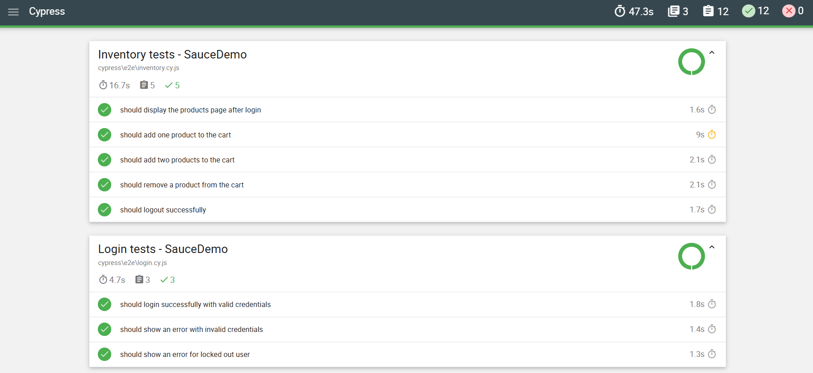

# SauceDemo Cypress Test Suite

## Project Overview

This project is an end-to-end test automation suite built with **Cypress** for the demo e-commerce website [SauceDemo](https://www.saucedemo.com/).

The goal of this project is to demonstrate how a QA process can move from functional analysis to test case design and automated execution, covering the most critical user flows of an online shopping application.

This repository is part of my QA Automation portfolio and focuses on practical testing skills such as test planning, risk-based prioritization, negative testing, bug detection, and maintainable Cypress automation.

---

## QA Objective

The objective of this project is to validate the main functionalities of a demo e-commerce platform, including:

* User login
* Product listing
* Shopping cart
* Checkout process
* Form validations
* Logout flow
* Negative scenarios

The test suite was designed to cover both happy paths and critical failure scenarios that could affect the user experience or business flow.

---

## Application Under Test

**Website:** SauceDemo
**URL:** https://www.saucedemo.com/
**Type:** Demo e-commerce application
**Main flow:** Login → Product selection → Cart → Checkout → Order confirmation

---

## Tools and Technologies

* Cypress
* JavaScript
* Node.js
* Git
* GitHub
* GitHub Actions
* Mochawesome Reporter

---

## Test Scope

### Included in scope

The automated tests cover the following areas:

* Login with valid credentials
* Login with invalid credentials
* Login with locked out user
* Product inventory visibility
* Add product to cart
* Remove product from cart
* Cart badge validation
* Checkout form validation
* Complete checkout flow
* Logout flow

### Out of scope

The following areas are not covered in this version:

* Performance testing
* API testing
* Visual regression testing
* Cross-browser testing beyond Cypress default configuration
* Accessibility testing

---

## Test Scenarios Automated

| ID     | Test Scenario                           | Priority | Type     |
| ------ | --------------------------------------- | -------- | -------- |
| TC-001 | Login with valid user                   | High     | Positive |
| TC-002 | Login with invalid credentials          | High     | Negative |
| TC-003 | Login with locked out user              | High     | Negative |
| TC-004 | Validate product inventory is displayed | High     | Positive |
| TC-005 | Add one product to the cart             | High     | Positive |
| TC-006 | Remove one product from the cart        | Medium   | Positive |
| TC-007 | Validate cart badge updates correctly   | High     | Positive |
| TC-008 | Complete checkout with valid data       | High     | Positive |
| TC-009 | Validate checkout form required fields  | High     | Negative |
| TC-010 | Logout successfully                     | Medium   | Positive |

---

## Risk-Based Testing Approach

The test cases were prioritized based on the impact each functionality has on the user journey and the business flow.

The highest priority was assigned to:

1. Login, because users cannot access the application without authentication.
2. Cart functionality, because it directly affects the shopping experience.
3. Checkout flow, because it represents the final conversion step.
4. Form validations, because missing or incorrect validation can create incomplete orders or poor user experience.

---

## Project Structure

```bash
saucedemo-cypress-tests/
│
├── cypress/
│   ├── e2e/
│   │   ├── login.cy.js
│   │   ├── inventory.cy.js
│   │   ├── cart.cy.js
│   │   └── checkout.cy.js
│   │
│   ├── fixtures/
│   │   └── users.json
│   │
│   ├── pages/
│   │   ├── LoginPage.js
│   │   ├── InventoryPage.js
│   │   ├── CartPage.js
│   │   └── CheckoutPage.js
│   │
│   └── support/
│       ├── commands.js
│       └── e2e.js
│
├── cypress.config.js
├── package.json
├── README.md
└── .github/
    └── workflows/
        └── cypress.yml
```

---

## How to Run the Project

### 1. Clone the repository

```bash
git clone https://github.com/your-username/saucedemo-cypress-tests.git
```

### 2. Install dependencies

```bash
npm install
```

### 3. Open Cypress Test Runner

```bash
npx cypress open
```

### 4. Run tests in headless mode

```bash
npx cypress run
```

### 5. Run tests with Mochawesome report

```bash
npx cypress run --reporter mochawesome
```

---

## GitHub Actions

This project includes a GitHub Actions workflow to run the Cypress test suite automatically on every push.

The purpose of the pipeline is to simulate a real QA automation workflow where tests are executed continuously to detect regressions early.

---

## Reports

Test execution reports are generated using **Mochawesome**.

The report includes:

* Total tests executed
* Passed tests
* Failed tests
* Execution time
* Screenshots for failed tests, when applicable

Add screenshot here:

```markdown

```

---

## QA Decisions

Some important decisions made during this project:

* I separated the test cases by feature to keep the suite organized and maintainable.
* I used Page Object Model to avoid duplicated selectors and improve readability.
* I prioritized the most critical business flows first: login, cart and checkout.
* I included negative scenarios to validate how the application handles errors.
* I added CI execution with GitHub Actions to show how automated tests can run continuously.

---

## What I Learned

Through this project, I practiced:

* Writing Cypress end-to-end tests
* Designing positive and negative test scenarios
* Structuring a test automation project
* Using reusable page objects
* Running tests locally and in CI
* Creating readable documentation for a QA portfolio
* Thinking about test prioritization based on user and business risk

---

## Next Improvements

Future improvements for this project:

* Add more edge cases for checkout validation
* Add API testing if endpoints are available
* Add accessibility checks
* Add visual testing
* Improve test data management
* Add tags by test type or priority
* Expand GitHub Actions configuration
* Add a test case matrix in Google Sheets or Markdown

---

## Portfolio Summary

This project demonstrates my ability to design and automate functional test cases for a web application using Cypress.

It shows practical QA skills including test planning, automation, reporting, maintainable structure, and continuous integration.

This project is aligned with QA Manual, QA Automation Junior, QA Analyst and Application Support roles.
